## ChromaDB 消息处理流程详解

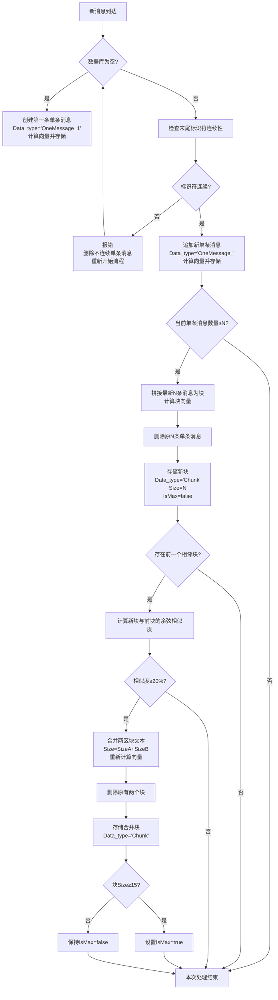

ChromaDB 旨在通过语义聚合，将 QQ 群聊消息处理成连贯的对话单元，优化存储结构并提升检索效率。该流程包括消息接收、连续性检查、单条消息处理、块生成、块合并和锁定等多个阶段。

### 1. 数据定义

#### 1.1 单条消息元数据 (Single Message Metadata)

```json
{
  "type": "single", // 类型：单条消息
  "message_type": "group/private", // 消息类型：群聊或私聊
  "index": 1, // 全局连续序号（由外部系统保证基本连续性）
  "group_id": "1234567890", // 群号
  "related_user_id": "[发送者ID]", // 关联用户 ID 列表// chromadb元数据限制值不能为列表, 因此related_user_id和related_msg_id的类型为字符串
  "related_msg_id": "[消息ID]", // 关联消息 ID 列表
  "earliest_send_time": 消息时间戳, // 最早发送时间
  "latest_send_time": 消息时间戳, // 最晚发送时间
  "message_count": 1 // 消息数量
}
```

#### 1.2 块元数据 (Chunk Metadata)

```json
{
  "type": "chunk", // 类型：块
  "message_type": "group/private", // 消息类型：群聊或私聊
  "chunk_index": 3, // 块的索引
  "group_id": "1234567890", // 群号
  "related_user_id": "[用户A,用户B,用户C]", // 关联用户 ID 列表 // chromadb元数据限制值不能为列表, 因此related_user_id和related_msg_id的类型为字符串
  "related_msg_id": "[msg1,msg2,msg3]", // 关联消息 ID 列表
  "earliest_send_time": 最早消息时间, // 最早发送时间
  "latest_send_time": 最新消息时间, // 最晚发送时间
  "message_count": 5, // 消息数量
  "is_max": false, // 是否达到最大尺寸 (>=15)
  "is_locked": false, // 是否锁定
  "merge_count": 0 // 合并次数
}
```

### 2. 流程步骤

#### 2.1 新消息到达

1.  **监听消息：** 系统监听 QQ 群聊消息事件。
2.  **提取字段：** 提取消息的关键字段，包括 `group_id`, `user_id`, `msg_id`, `send_time`, 和 `index`。

#### 2.2 首次消息处理 (数据库为空)

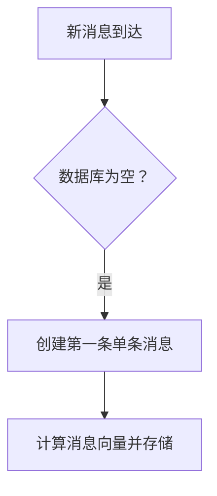

- **操作步骤：**
  1.  构建单条消息元数据。
  2.  立即计算消息向量并存储到 ChromaDB。

#### 2.3 连续性检查 (数据库不为空)

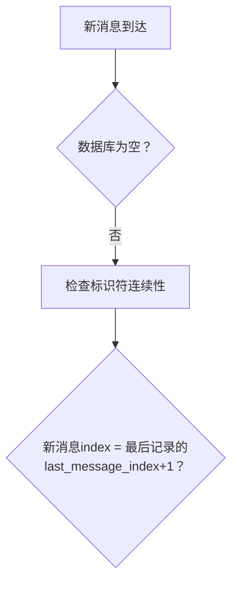

- **检查对象：**
  - 最后记录为单条消息：参考 `single.index`。
  - 最后记录为块：参考 `chunk.last_message_index`。
- **异常处理：** 如果 `新消息index != 最后记录的last_message_index + 1`，则删除所有 `index >= 新消息的记录`，并重新开始处理流程。

#### 2.4 追加单条消息 (连续)

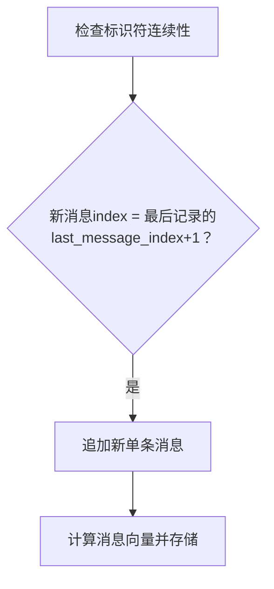

- **操作步骤：**
  1.  创建新的单条消息记录（`index` 自增）。
  2.  立即计算消息向量并存储到 ChromaDB。
  3.  更新数据库最后记录指针。

#### 2.5 块生成条件判断

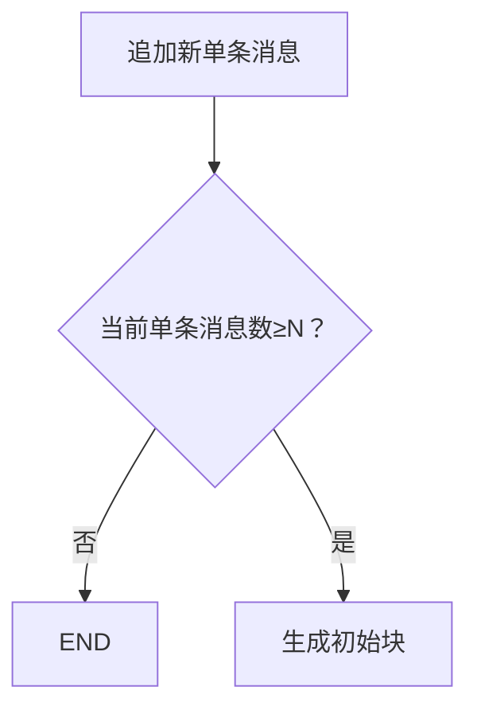

- **参数说明：**
  - `N = 5` (固定阈值)。
  - 仅处理**最新连续**的 N 条单条消息。

#### 2.6 初始块生成

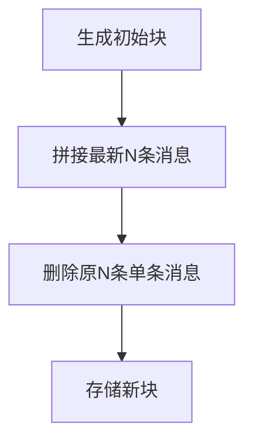

- **操作步骤：**
  1.  拼接最新的 N 条消息的文本内容。
  2.  删除原来的 N 条单条消息。
  3.  创建新的块元数据。
  4.  立即计算块向量并存储到 ChromaDB。
  5.  按时间顺序合并 `related_user_id` 和 `related_msg_id` 数组。

#### 2.7 块合并检测

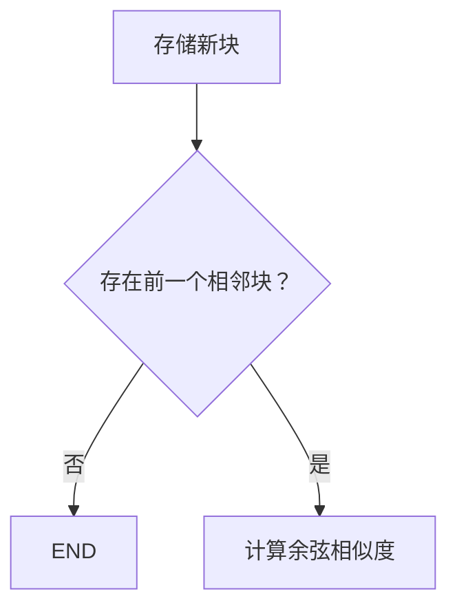

- **相邻块识别规则：**
  1.  按 `chunk_index` 顺序定位前一个块。
  2.  跳过 `is_locked = true` 的块。
  3.  要求块间时间连续（无消息间隔）。

#### 2.8 相似度判定

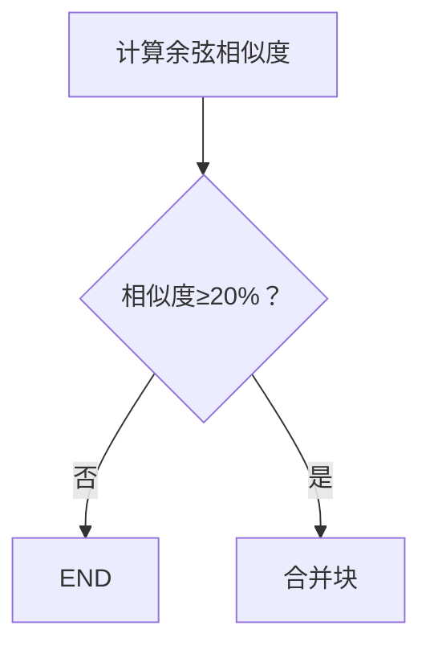

- **合并条件：**
  1.  仅当 `similarity >= 0.2` 时触发。
  2.  被合并块必须满足：
      - `is_locked = false`
      - `is_max = false`

#### 2.9 块合并操作

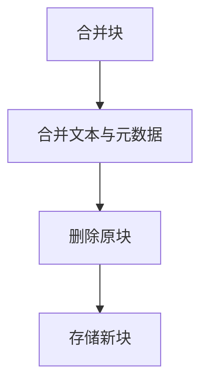

- **元数据合并规则：**
  - `related_user_id`: `[...前块, ...当前块]` (按时间顺序)
  - `related_msg_id`: `[...前块, ...当前块]` (按时间顺序)
  - `earliest_send_time`: `min(前块.earliest, 当前块.earliest)`
  - `latest_send_time`: `max(前块.latest, 当前块.latest)`
  - `message_count`: `前块.count + 当前块.count`
  - `is_max`: `(总 count >= 15) ? true : false`
  - `is_locked`: 同 `is_max`
  - `last_message_index`: `max(前块.last_index, 当前块.last_index)`
  - `merge_count`: `前块.merge_count + 当前块.merge_count + 1`
- **关键操作：**
  1.  立即重新计算合并块向量并存储到 ChromaDB。
  2.  递归检查新块是否可以继续向前合并。

#### 2.10 块锁定机制

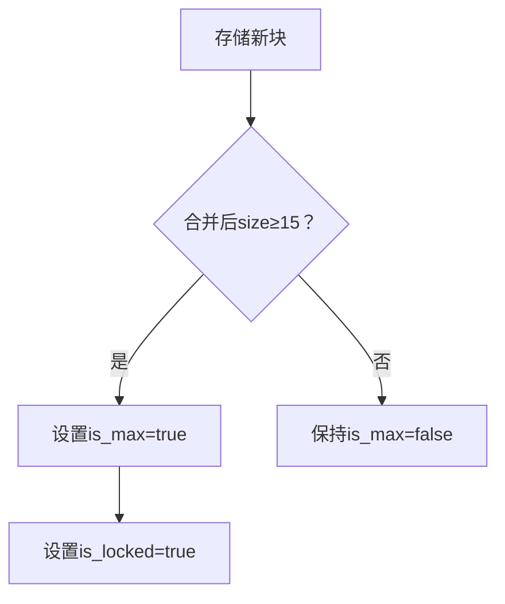

- **锁定效果：**
  1.  `is_locked = true` 的块：
      - 不参与后续相似度计算。
      - 禁止被合并。
      - 作为固定语义单元保留。
- **锁定条件：** `message_count >= 15`

### 3. 状态转换模型

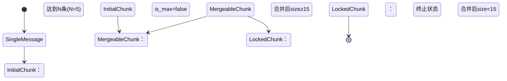

- **状态说明：**

  | 状态             | 特性                   | 可操作项             |
  | ---------------- | ---------------------- | -------------------- |
  | `SingleMessage`  | 原始消息状态           | 积累到 N 条时转换    |
  | `InitialChunk`   | 首次生成的块（size=N） | 可向前合并           |
  | `MergeableChunk` | 可合并块（size<15）    | 参与相似度计算和合并 |
  | `LockedChunk`    | 锁定块（size≥15）      | 不参与任何合并操作   |

### 4. 异常处理机制

1.  **标识符不连续：**
    - **触发条件：** `新index != 最后last_message_index + 1`
    - **处理流程：**
      1.  报错日志记录。
      2.  删除所有 `index >= 新消息的记录`。
      3.  重新开始处理流程。
2.  **向量计算失败：**
    - **处理流程：**
      1.  中止当前操作。
      2.  保持原始数据不变。
      3.  抛出系统警报。
3.  **并发冲突：**
    - **解决方案：**
      1.  采用乐观锁机制。
      2.  使用 `last_message_index` 作为版本号。
      3.  冲突时自动重试操作。

### 5. 设计优势总结

1.  **增量处理：** 消息实时处理，单事件内完成所有操作。
2.  **语义聚合：** 通过相似度驱动的块合并，形成连贯对话单元。
3.  **性能优化：**
    - 锁定块跳过计算。
    - 只处理最新消息。
    - 递归合并限制深度。
4.  **数据完整性：**
    - `related_msg_id` 保留原始 ID 链。
    - `merge_count` 跟踪合并历史。
    - 时间范围精确维护。
5.  **可扩展性：**
    - 阈值参数化 (`N = 5`, 相似度 `20%`)。
    - 状态标记支持策略调整。

这个详细的说明应该涵盖了 ChromaDB 消息处理流程的各个方面，包括数据定义、流程步骤、关键机制、异常处理和设计优势。希望对你有所帮助!
