# ChromaDB 元数据格式文档

## 概述
本文档详细说明了 QQ 群聊消息在 ChromaDB 中的元数据存储格式。系统使用两种数据结构：**单条消息（single）** 和 **消息块（chunk）**，支持高效的消息存储、检索和语义合并操作。

---

## 元数据结构

### 1. 单条消息（Single Message）

```json
{
    "type": "single",
    "index": 1,
    "group_id": "1234567890",
    "related_user_id": ["1234567890"],
    "related_msg_id": ["1234567890"],
    "earliest_send_time": 1753001024.0,
    "latest_send_time": 1753001024.0,
    "message_count": 1
}
```

#### 字段说明：
| 字段名 | 类型 | 描述 |
|--------|------|------|
| `type` | 字符串 | 固定值为 `"single"`，标识单条消息类型 |
| `index` | 整数 | **关键字段**<br>消息在群聊中的严格递增序号（从1开始）<br>用于连续性检查和顺序维护 |
| `group_id` | 字符串 | 群聊的唯一标识符 |
| `related_user_id` | 字符串数组 | 发送该消息的用户ID<br>单条消息只包含一个元素 |
| `related_msg_id` | 字符串数组 | 消息的唯一标识符<br>单条消息只包含一个元素 |
| `earliest_send_time` | 浮点数 | 消息发送时间戳（UNIX 时间） |
| `latest_send_time` | 浮点数 | 与 `earliest_send_time` 相同（单条消息特性） |
| `message_count` | 整数 | 固定为 `1`（单条消息特性） |

---

### 2. 消息块（Chunk）

```json
{
  "type": "chunk",
  "chunk_index": 3,
  "group_id": "1234567890",
  "related_user_id": ["12345", "67890", "54321"],
  "related_msg_id": ["11111", "22222", "33333"],
  "earliest_send_time": 1753001000.0,
  "latest_send_time": 1753002000.0,
  "message_count": 5,
  "is_max": false,
  "is_locked": false,
  "last_message_index": 42,
  "merge_count": 0
}
```

#### 字段说明：
| 字段名 | 类型 | 描述 |
|--------|------|------|
| `type` | 字符串 | 固定值为 `"chunk"`，标识消息块类型 |
| `chunk_index` | 整数 | **关键字段**<br>块的顺序编号（非连续）<br>用于识别"前一个相邻块" |
| `group_id` | 字符串 | 群聊的唯一标识符 |
| `related_user_id` | 字符串数组 | 块中所有消息的发送者ID<br>按时间顺序排列 |
| `related_msg_id` | 字符串数组 | 块中所有消息的唯一标识符<br>按时间顺序排列 |
| `earliest_send_time` | 浮点数 | 块中最早消息的发送时间 |
| `latest_send_time` | 浮点数 | 块中最新消息的发送时间 |
| `message_count` | 整数 | 块中包含的消息总数 |
| `is_max` | 布尔值 | **关键状态标记**<br>`true`：块已达到最大尺寸（≥15条）<br>`false`：块可继续合并 |
| `is_locked` | 布尔值 | **关键状态标记**<br>`true`：块被锁定，禁止合并操作<br>（当 `is_max=true` 时自动锁定） |
| `last_message_index` | 整数 | **关键字段**<br>块中最后一条消息的全局索引<br>用于新消息的连续性检查 |
| `merge_count` | 整数 | 块被合并的次数<br>初始为 `0`，每次合并递增<br>用于监控块演化过程 |

---

## 关键机制说明

### 1. 连续性检查机制
- **检查依据**：新消息的 `index` 必须等于最新记录的 `last_message_index + 1`
- **异常处理**：不连续时触发报错并删除不连续数据
- **单条消息**：`index` 字段提供连续性依据
- **消息块**：`last_message_index` 字段提供连续性依据

### 2. 块合并规则
当两个块满足相似度条件（≥20%）时：
1. 合并文本内容
2. 更新元数据：
   ```json
   {
     "related_user_id": [...块A, ...块B], // 按时间顺序合并
     "related_msg_id": [...块A, ...块B], // 按时间顺序合并
     "earliest_send_time": min(块A.earliest, 块B.earliest),
     "latest_send_time": max(块A.latest, 块B.latest),
     "message_count": 块A.count + 块B.count,
     "is_max": (块A.count + 块B.count >= 15),
     "is_locked": (块A.count + 块B.count >= 15),
     "last_message_index": max(块A.last_index, 块B.last_index),
     "merge_count": 块A.merge_count + 块B.merge_count + 1
   }
   ```
3. 删除原始块

### 3. 状态转换规则
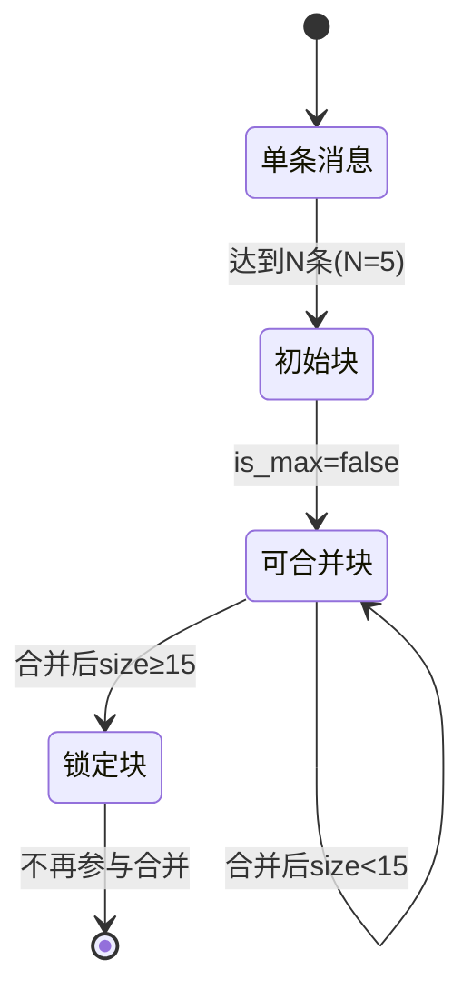

### 4. 操作约束
1. **单条消息**：
   - 仅存在于最新端
   - 达到N条后立即转换为块
   - 转换后立即删除

2. **消息块**：
   - `is_locked=true` 时跳过所有合并操作
   - 只与**前一个相邻块**比较相似度
   - 合并后立即重新计算向量

---

## 设计优势

1. **高效检索**：
   - 通过 `chunk_index` 和 `last_message_index` 实现快速定位
   - `is_max` 标记避免扫描锁定块

2. **数据完整性**：
   - `related_msg_id` 保留原始消息ID链
   - `content_hash` 确保向量与内容一致

3. **流程控制**：
   - `is_locked` 防止无效合并操作
   - `merge_count` 提供合并历史追踪

4. **时空优化**：
   - 时间范围字段 (`earliest/latest_send_time`) 支持时间范围查询
   - 块合并减少存储碎片

# ChromaDB 消息处理流程详解

根据提供的元数据格式文档和流程图，以下是完整的消息处理流程说明：

## 一、新消息到达

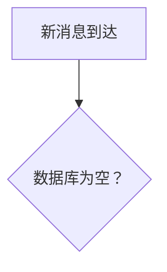

### 处理逻辑：

1. 系统监听 QQ 群聊消息事件
2. 提取消息关键字段：
   - `group_id`：群号
   - `user_id`：发送者 ID
   - `msg_id`：消息 ID
   - `send_time`：时间戳
   - `index`：全局连续序号（由外部系统保证基本连续性）

---

## 二、首次消息处理

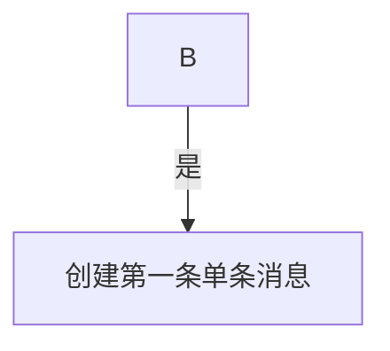

### 操作步骤：

1. 构建单条消息元数据：
   ```json
   {
     "type": "single",
     "index": 1,
     "group_id": "1234567890",
     "related_user_id": ["发送者ID"],
     "related_msg_id": ["消息ID"],
     "earliest_send_time": 消息时间戳,
     "latest_send_time": 消息时间戳,
     "message_count": 1
   }
   ```
2. **立即计算消息向量**并存储
3. 结束流程

---

## 三、连续性检查

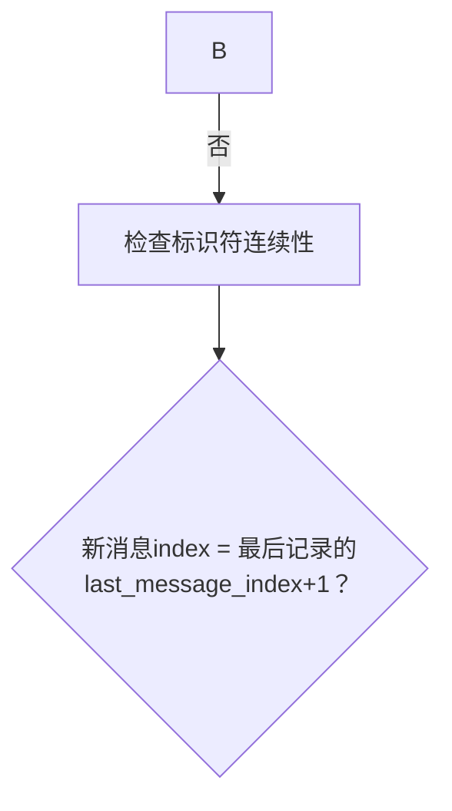

### 关键机制：

| 检查对象       | 参考字段                   | 异常处理                          |
| -------------- | -------------------------- | --------------------------------- |
| 最后记录为单条 | `single.index`             | 删除所有 index≥ 新消息的记录      |
| 最后记录为块   | `chunk.last_message_index` | 删除所有 last_index≥ 新消息的记录 |

---

## 四、追加单条消息

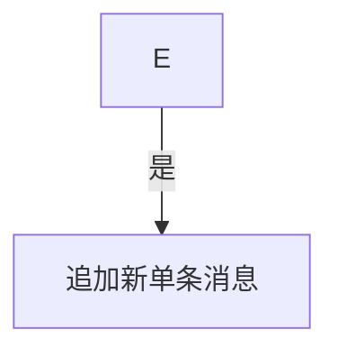

### 操作步骤：

1. 创建新单条消息记录（`index`自增）
2. **立即计算消息向量**并存储
3. 更新数据库最后记录指针

---

## 五、块生成条件判断

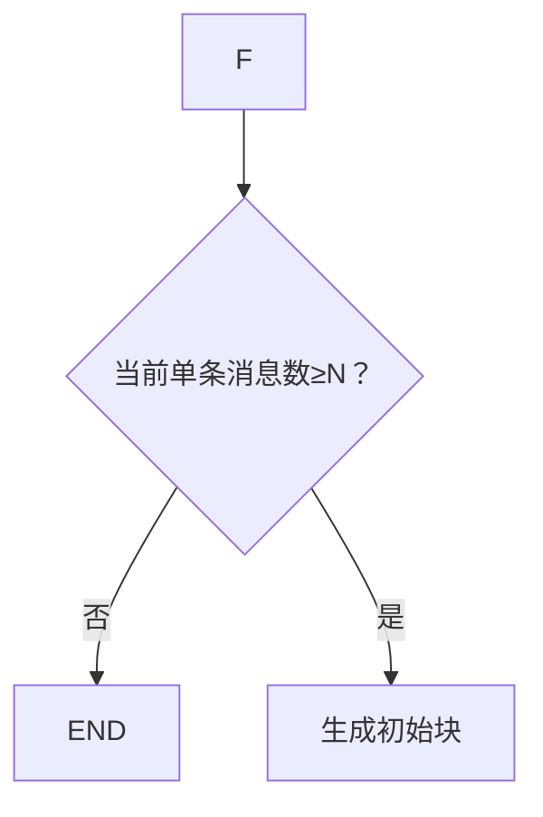

### 参数说明：

- `N=5`（固定阈值）
- 仅处理**最新连续**的 N 条单条消息

---

## 六、初始块生成

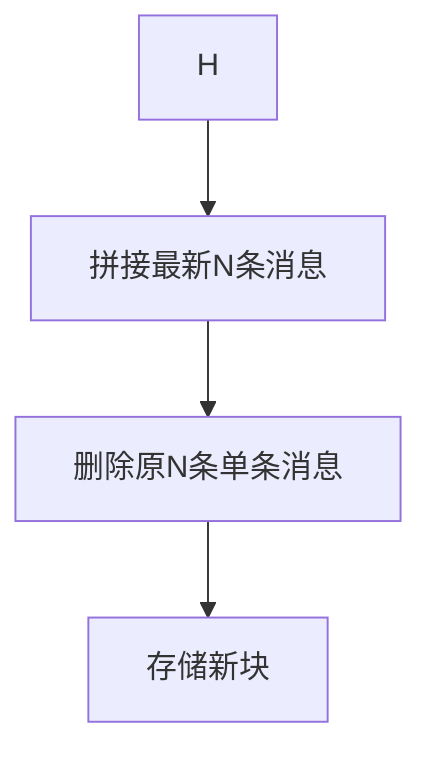

### 块元数据示例：

```json
{
  "type": "chunk",
  "chunk_index": 3,
  "group_id": "1234567890",
  "related_user_id": ["用户A","用户B","用户C"],
  "related_msg_id": ["msg1","msg2","msg3"],
  "earliest_send_time": 最早消息时间,
  "latest_send_time": 最新消息时间,
  "message_count": 5,
  "is_max": false,
  "is_locked": false,
  "last_message_index": 最后一条的index,
  "merge_count": 0
}
```

### 关键操作：

1. **立即计算块向量**（基于拼接后的完整文本）
2. 按时间顺序合并`related_user_id`和`related_msg_id`数组

---

## 七、块合并检测

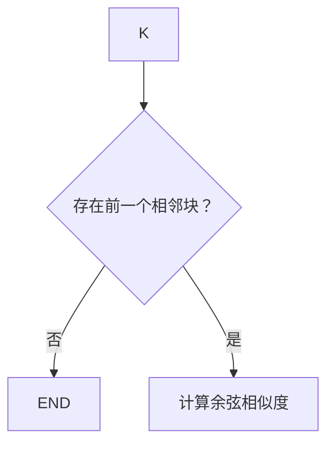

### 相邻块识别规则：

1. 按`chunk_index`顺序定位前一个块
2. 跳过`is_locked=true`的块
3. 要求块间时间连续（无消息间隔）

---

## 八、相似度判定

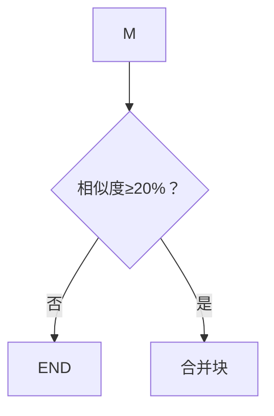

### 合并条件：

1. 仅当`similarity >= 0.2`时触发
2. 被合并块必须满足：
   - `is_locked=false`
   - `is_max=false`

---

## 九、块合并操作

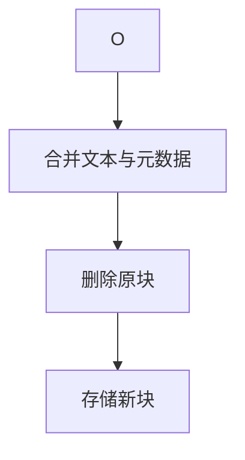

### 元数据合并规则：

| 字段                 | 合并规则                                  |
| -------------------- | ----------------------------------------- |
| `related_user_id`    | [...前块, ...当前块] 按时间顺序           |
| `related_msg_id`     | [...前块, ...当前块] 按时间顺序           |
| `earliest_send_time` | min(前块.earliest, 当前块.earliest)       |
| `latest_send_time`   | max(前块.latest, 当前块.latest)           |
| `message_count`      | 前块.count + 当前块.count                 |
| `is_max`             | (总 count≥15) ? true : false              |
| `is_locked`          | 同`is_max`                                |
| `last_message_index` | max(前块.last_index, 当前块.last_index)   |
| `merge_count`        | 前块.merge_count + 当前块.merge_count + 1 |

### 关键操作：

1. **立即重新计算合并块向量**
2. 递归检查新块是否可以继续向前合并

---

## 十、块锁定机制

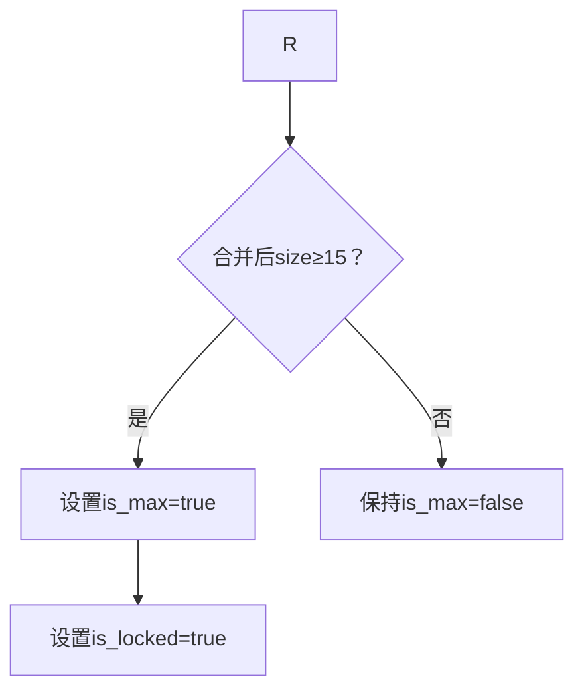

### 锁定效果：

1. `is_locked=true`的块：
   - 不参与后续相似度计算
   - 禁止被合并
   - 作为固定语义单元保留
2. 锁定条件：`message_count >= 15`

---

## 十一、状态转换模型

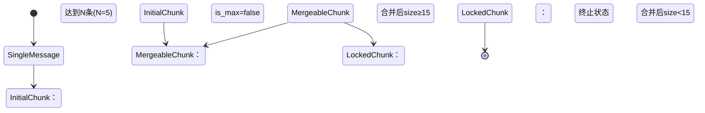

### 状态说明：

| 状态             | 特性                   | 可操作项             |
| ---------------- | ---------------------- | -------------------- |
| `SingleMessage`  | 原始消息状态           | 积累到 N 条时转换    |
| `InitialChunk`   | 首次生成的块（size=N） | 可向前合并           |
| `MergeableChunk` | 可合并块（size<15）    | 参与相似度计算和合并 |
| `LockedChunk`    | 锁定块（size≥15）      | 不参与任何合并操作   |

---

## 十二、异常处理机制

### 1. 标识符不连续

- **触发条件**：`新index ≠ 最后last_message_index+1`
- **处理流程**：
  1. 报错日志记录
  2. 删除所有 index≥ 新消息的记录
  3. 重新开始处理流程

### 2. 向量计算失败

- **处理流程**：
  1. 中止当前操作
  2. 保持原始数据不变
  3. 抛出系统警报

### 3. 并发冲突

- **解决方案**：
  1. 采用乐观锁机制
  2. 使用`last_message_index`作为版本号
  3. 冲突时自动重试操作

---

## 设计优势总结

1. **增量处理**
   消息实时处理，单事件内完成所有操作

2. **语义聚合**
   通过相似度驱动的块合并，形成连贯对话单元

3. **性能优化**

   - 锁定块跳过计算
   - 只处理最新消息
   - 递归合并限制深度

4. **数据完整性**

   - `related_msg_id`保留原始 ID 链
   - `merge_count`跟踪合并历史
   - 时间范围精确维护

5. **可扩展性**
   - 阈值参数化（N=5, 相似度 20%）
   - 状态标记支持策略调整

此流程确保在保持消息时序性的同时，通过语义驱动动态构建对话块，优化存储结构并提升检索效率。
